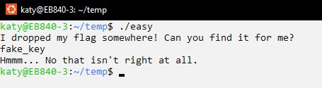

# Easy Encrypt

> RE is fun but these binary things are so weird!

The first step was to set the ELF file permissions and run it to see what we were dealing with:

`sudo chmod +x ./easy`

`./easy`

As shown below, the program prompts the user for a flag. After we entered an arbitrary input ("fake_key"), the program let us know that we were wrong and then terminated.



Now that we had an idea of what was going on, we opened up the file in Ghidra. Running a search for all strings allowed us to locate the section in the decompiled code where the user is prompted for the flag. We then further honed in on the section where the user input is compared to an expected value:

```C
  local_40 = *(long *)(in_FS_OFFSET + 0x28);
  puts("I dropped my flag somewhere! Can you find it for me?");
  fgets(local_148,0x100,stdin);
  sVar4 = strcspn(local_148,"\n");
  local_148[sVar4] = '\0';
  local_188 = strlen(local_148);
  local_168 = 0x7f04487763707073;
  local_160 = 0x435d4005406c0405;
  local_158 = 0x734107796803406e;
  local_150 = 0x4c;
  local_180 = local_188 - 1;
  uVar5 = ((local_188 + 0xf) / 0x10) * 0x10;
  for (psVar6 = &local_188; psVar6 != (size_t *)((long)&local_188 - (uVar5 & 0xfffffffffffff000));
      psVar6 = (size_t *)((long)psVar6 + -0x1000)) {
    *(undefined8 *)((long)psVar6 + -8) = *(undefined8 *)((long)psVar6 + -8);
  }
  lVar1 = -(ulong)((uint)uVar5 & 0xfff);
  if ((uVar5 & 0xfff) != 0) {
    *(undefined8 *)((long)psVar6 + ((ulong)((uint)uVar5 & 0xfff) - 8) + lVar1) =
         *(undefined8 *)((long)psVar6 + ((ulong)((uint)uVar5 & 0xfff) - 8) + lVar1);
  }
  sVar4 = local_188;
  local_178 = (undefined *)((long)psVar6 + lVar1);
  *(undefined8 *)((long)psVar6 + lVar1 + -8) = 0x10142f;
  memcpy((undefined *)((long)psVar6 + lVar1),local_148,sVar4);
  puVar2 = local_178;
  sVar4 = local_188;
  local_16c = 0x37333331;
  *(undefined8 *)((long)psVar6 + lVar1 + -8) = 0x101459;
  xor(puVar2,&local_16c,sVar4);
  puVar2 = local_178;
  *(undefined8 *)((long)psVar6 + lVar1 + -8) = 0x101477;
  iVar3 = memcmp(puVar2,&local_168,0x19);
  if (iVar3 == 0) {
    *(undefined8 *)((long)psVar6 + lVar1 + -8) = 0x10148a;
    puts("There it is!");
  }
  else {
    *(undefined8 *)((long)psVar6 + lVar1 + -8) = 0x10149b;
    puts("Hmmm... No that isn\'t right at all.");
  }
```

Basically, the program is XORing the user's input string with the value 0x37333331 and then comparing it to the hidden value. If you reverse this XOR operation, you can find the correct flag. I did this with the following python script:

```Python
expected_vals = [0x7f04487763707073, 0x435d4005406c0405, 0x734107796803406e, 0x4c]

# since the expected values are 8 bytes, you need to extend the key (0x37333331) to 8 bytes as well
xor_val = 0x3733333137333331

flag_vals = [val ^ xor_val for val in expected_vals]

original_flag = "".join(value.to_bytes(8, 'little').decode("utf-8") for value in flag_vals)

print(f'{original_flag = }')
```

Flag: `BCCTF{7H47_w4snt_s0_H4rD}`
