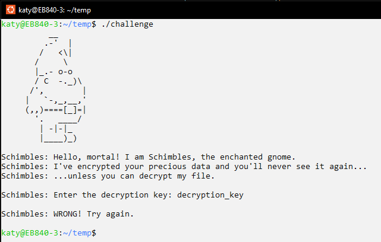
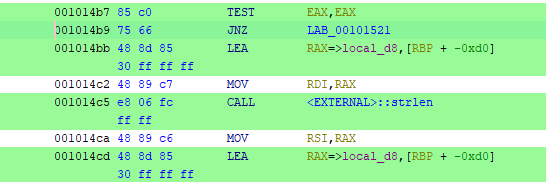
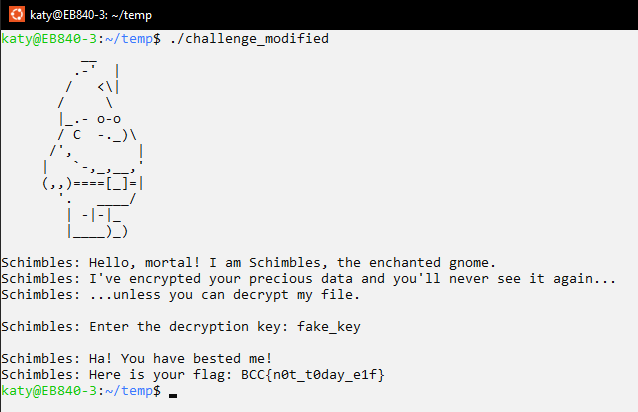

# Shimbles the E-L-F

> Shimbles the ELF has encrpyted your data, and wants you to suffer. Show Shimbles humans are not to be trifiled with.
> Hint: Look into the decryption cycle super close, the key is hidden behind two layers of bit rotatation and obfuscation.

The first step was to set the ELF file permissions and run it to see what we were dealing with:

`sudo chmod +x ./challenge`

`./challenge`

As shown below, the program prompts the user for a decryption key. After we entered an arbitrary input ("decryption_key"), the program let us know that we were wrong and then terminated.



Now that we had an idea of what was going on, we opened up the file in Ghidra. Running a search for all strings allowed us to locate the section in the decompiled code where the user is prompted for the decryption key. We then further honed in on the section where the user input is compared to an expected value:

```C
iVar1 = strcmp(local_98,(char *)&local_e1);
if (iVar1 == 0) {
    sVar4 = strlen((char *)&local_d8);
    two_layer_decrypt(&local_d8,sVar4,0x77,4,0x3c,3);
    puts("\nSchimbles: Ha! You have bested me!");
    printf("Schimbles: Here is your flag: %s\n",&local_d8);
}
else {
    sVar4 = strlen((char *)&local_b8);
    two_layer_decrypt(&local_b8,sVar4,0x6d,2,0x33,5);
    printf("\nSchimbles: %s\n",&local_b8);
}
```

Here is a screenshot of the associated assembly instructions:


We decided to use the "Patch Instruction" feature in Ghidra to make the program jump to giving us the flag whenever we give Schimbles the *wrong* key. This was accomplished by changing the JNZ (jump if not zero) instruction to the JZ (jump if zero) instruction.

We exported our modified version of the program and ran it:



Flag: `BCC{n0t_t0day_e1f}`
